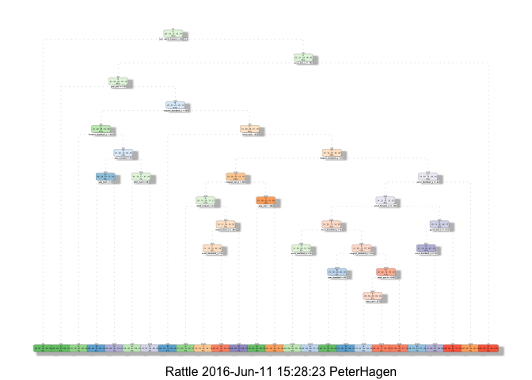
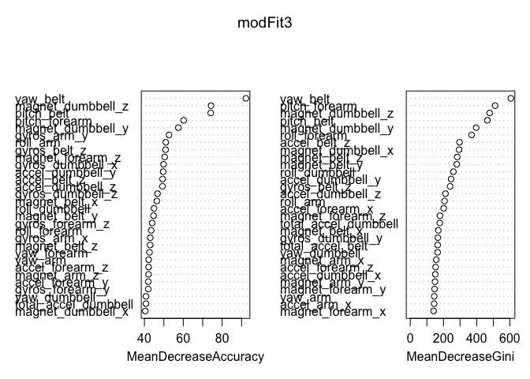

# Prediction Assignment
Peter Hagen  
June 10, 2016  
###Assignment
Using devices such as Jawbone Up, Nike FuelBand, and Fitbit it is now possible to collect a large amount of data about personal activity relatively inexpensively. These type of devices are part of the quantified self movement – a group of enthusiasts who take measurements about themselves regularly to improve their health, to find patterns in their behavior, or because they are tech geeks. One thing that people regularly do is quantify how much of a particular activity they do, but they rarely quantify how well they do it. In this project, your goal will be to use data from accelerometers on the belt, forearm, arm, and dumbell of 6 participants. They were asked to perform barbell lifts correctly and incorrectly in 5 different ways. More information is available from the website here: http://groupware.les.inf.puc-rio.br/har (see the section on the Weight Lifting Exercise Dataset).

####Data

The training data for this project are available here:

https://d396qusza40orc.cloudfront.net/predmachlearn/pml-training.csv

The test data are available here:

https://d396qusza40orc.cloudfront.net/predmachlearn/pml-testing.csv

The data for this project come from this source: http://groupware.les.inf.puc-rio.br/har. If you use the document you create for this class for any purpose please cite them as they have been very generous in allowing their data to be used for this kind of assignment.


###Setting up Environment

```r
library(caret)
```

```
## Loading required package: lattice
```

```
## Loading required package: ggplot2
```

```r
library(rpart)
library(rattle)
```

```
## Rattle: A free graphical interface for data mining with R.
## Version 4.1.0 Copyright (c) 2006-2015 Togaware Pty Ltd.
## Type 'rattle()' to shake, rattle, and roll your data.
```

```r
library(randomForest)
```

```
## randomForest 4.6-12
```

```
## Type rfNews() to see new features/changes/bug fixes.
```

```
## 
## Attaching package: 'randomForest'
```

```
## The following object is masked from 'package:ggplot2':
## 
##     margin
```

```r
training <- read.csv("~/Desktop/Machine_Learning/pml-training.csv", na.strings = c("", "NA", "NULL"))
testing <- read.csv("~/Desktop/Machine_Learning/pml-testing.csv", na.strings = c("", "NA", "NULL"))
```

###Cleaning Data
I set classe to factors, remove the columns with any NAs and the first 8 columns which are not useful.

```r
training$classe <- as.factor(training$classe)  

training <- training[ , colSums(is.na(training)) == 0]
testing <- testing[ , colSums(is.na(testing)) == 0]

train.trim <- training[, -(1:8)]
```

##Cross Validation
A cross validation dataset is made by partitioning the cleaned training set. This will be used for cross validation when building the models and testing them before applying them to the final test set.

```r
set.seed(123321)
inTrain = createDataPartition(train.trim$classe, p = 0.60, list=FALSE)
train = train.trim[inTrain,]
train.test = train.trim[-inTrain,]
```

###Classification Tree Model
Here a classification tree is built to test our accuracy before more complicated models are considered. 

```r
set.seed(121212)
modFit1 <- rpart(classe ~ ., data = train, method="class")
fancyRpartPlot(modFit1)
```

```
## Warning: labs do not fit even at cex 0.15, there may be some overplotting
```




###Classification Tree Results
The classification tres received an Out of Sample Error of 27.34% which is actually not terrible considereing accepteble predictions can be around 80%. However, when it was run on the final test set and the highest probability choices where chosen for the quiz I only recieved a 55%. The nice thing about the results is I am given a second less likely option which acould be chosen once you know the incorrect results. Still a random forests should yield much more accurate results on the first go. 

```r
set.seed(321123)

pred.modFit1 <- predict(modFit1, train, type = "class")
confusionMatrix(pred.modFit1, train$classe)
```

```
## Confusion Matrix and Statistics
## 
##           Reference
## Prediction    A    B    C    D    E
##          A 2920  360   67  140  140
##          B   69 1489  278  123  212
##          C  121  273 1466  295  306
##          D  204  133  145 1266  170
##          E   34   24   98  106 1337
## 
## Overall Statistics
##                                          
##                Accuracy : 0.7199         
##                  95% CI : (0.7117, 0.728)
##     No Information Rate : 0.2843         
##     P-Value [Acc > NIR] : < 2.2e-16      
##                                          
##                   Kappa : 0.6449         
##  Mcnemar's Test P-Value : < 2.2e-16      
## 
## Statistics by Class:
## 
##                      Class: A Class: B Class: C Class: D Class: E
## Sensitivity            0.8722   0.6534   0.7137   0.6560   0.6176
## Specificity            0.9161   0.9282   0.8977   0.9338   0.9727
## Pos Pred Value         0.8051   0.6859   0.5957   0.6601   0.8361
## Neg Pred Value         0.9475   0.9178   0.9369   0.9326   0.9186
## Prevalence             0.2843   0.1935   0.1744   0.1639   0.1838
## Detection Rate         0.2480   0.1264   0.1245   0.1075   0.1135
## Detection Prevalence   0.3080   0.1844   0.2090   0.1629   0.1358
## Balanced Accuracy      0.8941   0.7908   0.8057   0.7949   0.7951
```

```r
pred.modFit1 <- predict(modFit1, train.test, type = "class")
confusionMatrix(pred.modFit1, train.test$classe)
```

```
## Confusion Matrix and Statistics
## 
##           Reference
## Prediction    A    B    C    D    E
##          A 1958  220   46  102   81
##          B   37 1011  162   90  127
##          C   90  171  988  181  194
##          D  123   97  113  842  138
##          E   24   19   59   71  902
## 
## Overall Statistics
##                                           
##                Accuracy : 0.7266          
##                  95% CI : (0.7166, 0.7365)
##     No Information Rate : 0.2845          
##     P-Value [Acc > NIR] : < 2.2e-16       
##                                           
##                   Kappa : 0.6534          
##  Mcnemar's Test P-Value : < 2.2e-16       
## 
## Statistics by Class:
## 
##                      Class: A Class: B Class: C Class: D Class: E
## Sensitivity            0.8772   0.6660   0.7222   0.6547   0.6255
## Specificity            0.9200   0.9343   0.9018   0.9282   0.9730
## Pos Pred Value         0.8135   0.7085   0.6084   0.6413   0.8391
## Neg Pred Value         0.9496   0.9210   0.9389   0.9320   0.9202
## Prevalence             0.2845   0.1935   0.1744   0.1639   0.1838
## Detection Rate         0.2496   0.1289   0.1259   0.1073   0.1150
## Detection Prevalence   0.3068   0.1819   0.2070   0.1673   0.1370
## Balanced Accuracy      0.8986   0.8001   0.8120   0.7915   0.7993
```

```r
testing.pred <- predict(modFit1, testing)
testing.pred
```

```
##              A           B          C           D          E
## 1  0.582677165 0.320209974 0.06824147 0.015748031 0.01312336
## 2  0.840579710 0.137681159 0.00000000 0.000000000 0.02173913
## 3  0.012519562 0.469483568 0.28012520 0.039123631 0.19874804
## 4  0.956521739 0.043478261 0.00000000 0.000000000 0.00000000
## 5  0.767326733 0.002475248 0.09900990 0.022277228 0.10891089
## 6  0.006838906 0.094224924 0.64361702 0.160334347 0.09498480
## 7  0.117213115 0.079508197 0.02295082 0.688524590 0.09180328
## 8  0.117213115 0.079508197 0.02295082 0.688524590 0.09180328
## 9  0.992738589 0.007261411 0.00000000 0.000000000 0.00000000
## 10 0.751418842 0.190692395 0.00000000 0.001135074 0.05675369
## 11 0.006838906 0.094224924 0.64361702 0.160334347 0.09498480
## 12 0.012519562 0.469483568 0.28012520 0.039123631 0.19874804
## 13 0.147952444 0.186261559 0.43064729 0.099075297 0.13606341
## 14 0.992738589 0.007261411 0.00000000 0.000000000 0.00000000
## 15 0.075757576 0.018939394 0.17424242 0.034090909 0.69696970
## 16 0.012519562 0.469483568 0.28012520 0.039123631 0.19874804
## 17 0.767326733 0.002475248 0.09900990 0.022277228 0.10891089
## 18 0.751418842 0.190692395 0.00000000 0.001135074 0.05675369
## 19 0.582677165 0.320209974 0.06824147 0.015748031 0.01312336
## 20 0.012519562 0.469483568 0.28012520 0.039123631 0.19874804
```


###Random Forest 
This creates the random forest model which works very well for prediction in data sets with many uncorrelated variables. It works by createing many classification trees that use random subsets of variables then aggregrates the results. I choose to create 1000 random classification trees which may be overfitting. Also I found that using the randomForest function to be much faster than the train function. The run time for randomForest was about 3 min while for the train() it could be 15 min.

```r
set.seed(98789)

startTime <- Sys.time();
modFit3 <- randomForest(classe ~ ., data = train, ntree = 1000, importance=TRUE)
endTime <- Sys.time()
endTime - startTime
```

```
## Time difference of 3.295886 mins
```


###Variable Importance Plot
For each variable in the matrix this plot tells you hoq important the variable is in classifying your data. Top is the most important bottom is least important. Mor information at https://dinsdalelab.sdsu.edu/metag.stats/code/randomforest.html

```r
varImpPlot(modFit3)
```




###Random Forest Model Result
This is the RF results on the train dataset. An important mark is the Out of Bag error rate of 0.69%. 

```r
modFit3
```

```
## 
## Call:
##  randomForest(formula = classe ~ ., data = train, ntree = 1000,      importance = TRUE) 
##                Type of random forest: classification
##                      Number of trees: 1000
## No. of variables tried at each split: 7
## 
##         OOB estimate of  error rate: 0.69%
## Confusion matrix:
##      A    B    C    D    E class.error
## A 3344    2    0    0    2 0.001194743
## B   21 2253    5    0    0 0.011408513
## C    0   19 2033    2    0 0.010223953
## D    0    0   23 1907    0 0.011917098
## E    0    0    2    5 2158 0.003233256
```


###Random Forest Cross Validation Set Prediction
Below are the results for the predictions on the train.test dataset (cross validation set). 

The In Sample Error Rate is 0%. This means the model is probably overfitted.

The Out of Sample Error Rate is 1 - Accuracy from out of sample test = 1 - 0.994 = 1.6%

```r
train.pred <- predict(modFit3, train)
confusionMatrix(train.pred, train$classe)
```

```
## Confusion Matrix and Statistics
## 
##           Reference
## Prediction    A    B    C    D    E
##          A 3348    0    0    0    0
##          B    0 2279    0    0    0
##          C    0    0 2054    0    0
##          D    0    0    0 1930    0
##          E    0    0    0    0 2165
## 
## Overall Statistics
##                                      
##                Accuracy : 1          
##                  95% CI : (0.9997, 1)
##     No Information Rate : 0.2843     
##     P-Value [Acc > NIR] : < 2.2e-16  
##                                      
##                   Kappa : 1          
##  Mcnemar's Test P-Value : NA         
## 
## Statistics by Class:
## 
##                      Class: A Class: B Class: C Class: D Class: E
## Sensitivity            1.0000   1.0000   1.0000   1.0000   1.0000
## Specificity            1.0000   1.0000   1.0000   1.0000   1.0000
## Pos Pred Value         1.0000   1.0000   1.0000   1.0000   1.0000
## Neg Pred Value         1.0000   1.0000   1.0000   1.0000   1.0000
## Prevalence             0.2843   0.1935   0.1744   0.1639   0.1838
## Detection Rate         0.2843   0.1935   0.1744   0.1639   0.1838
## Detection Prevalence   0.2843   0.1935   0.1744   0.1639   0.1838
## Balanced Accuracy      1.0000   1.0000   1.0000   1.0000   1.0000
```

```r
train.test.pred <- predict(modFit3, train.test)
confusionMatrix(train.test.pred, train.test$classe)
```

```
## Confusion Matrix and Statistics
## 
##           Reference
## Prediction    A    B    C    D    E
##          A 2231   18    0    0    0
##          B    0 1498    7    0    0
##          C    0    2 1360   12    2
##          D    1    0    1 1273    3
##          E    0    0    0    1 1437
## 
## Overall Statistics
##                                          
##                Accuracy : 0.994          
##                  95% CI : (0.992, 0.9956)
##     No Information Rate : 0.2845         
##     P-Value [Acc > NIR] : < 2.2e-16      
##                                          
##                   Kappa : 0.9924         
##  Mcnemar's Test P-Value : NA             
## 
## Statistics by Class:
## 
##                      Class: A Class: B Class: C Class: D Class: E
## Sensitivity            0.9996   0.9868   0.9942   0.9899   0.9965
## Specificity            0.9968   0.9989   0.9975   0.9992   0.9998
## Pos Pred Value         0.9920   0.9953   0.9884   0.9961   0.9993
## Neg Pred Value         0.9998   0.9968   0.9988   0.9980   0.9992
## Prevalence             0.2845   0.1935   0.1744   0.1639   0.1838
## Detection Rate         0.2843   0.1909   0.1733   0.1622   0.1832
## Detection Prevalence   0.2866   0.1918   0.1754   0.1629   0.1833
## Balanced Accuracy      0.9982   0.9929   0.9958   0.9946   0.9982
```

###Final Test Set Prediction
These final results where submitted and revieved 100% on the test set quiz. So even though the model is probably overfitted it predicted the correct results.

```r
testing.pred <- predict(modFit3, testing)
testing.pred
```

```
##  1  2  3  4  5  6  7  8  9 10 11 12 13 14 15 16 17 18 19 20 
##  B  A  B  A  A  E  D  B  A  A  B  C  B  A  E  E  A  B  B  B 
## Levels: A B C D E
```

###Conclusion
The Random Forest Model is an incredibly powerful model and worked well under these conditions. In predicion modeling where there are a high amount of variables that can be weighed for impacts on accuracy(answers need to be supplied) than random forests should be top on the choices for modeling techniques
